# Tweaks for Visual Studio

A collection of minor fixes and tweaks for Visual Studio to reduce the paper cuts and make you a happier developer

Download this extension from the [Marketplace](https://marketplace.visualstudio.com/items?itemName=MadsKristensen.Tweaks)
or get the [CI build](https://www.vsixgallery.com/extension/0c8bd9fa-77d5-4563-ab57-9e01608c3d04).

----------------------------------------------

## Features
The list of features are coming from the [Visual Studio Developer Community](https://developercommunity.visualstudio.com/topics/extension+candidate.html?page=1&pageSize=15&sort=votes&openOnly=false&closedOnly=false&topics=extension%20candidate) where users are posting feature suggestions and problem report tickets. 
It's from those tickets inspiration for this extension came.

* **General**
  * [Re-open closed file](#reopen)
  * [Auto save documents and projects](#autosave)
  * [Ctrl+W closes current document](#closetab)
  * [Keyboard shortcut to *Add New Folder*](#addfolder)
  * [Focus *Solution Explorer* on project load](#showsolexp)
  * [Clear list of recent files and projects](#clearmru)
* **IDE**
  * [Restart Visual Studio command](#restart)
  * [Open in */SafeMode* from Jump List](#safemode)
  * [Presentation Mode](#demomode)
  * [Browse all feature suggestions](#browsesuggestions)
* **Build**
  * [Set verbosity level in Output Window](#outputverbosity)
  * [Save solution on build](#savesolutiononbuild)
  * [Delete obj and bin folders on *Clean*](#deleteoutputartifacts)
  * [Show build time statistics](#buildstats)
* **Debugger**
  * [Don't start debug on F10/F11](#nodebugonf10)
  * [Toggle *Just My Code* from the *Debug* toolbar](#justmycode)
* **Editor**
  * [Run *Code Cleanup* on format](#codecleanup)
  * [Don't copy empty lines](#dontcopyemptylines)
  * [Don't copy when there's no selection](#dontcopyemptyselection)
  * [Copy without indentation](#copywithoutindentation)
  * [Format on moving line up/down](#formatonlinemove)
  * [Disable editor zoom on mouse wheel](#disablezoom)
  * [Shortcut to set zoom to 100%](#resetzoom)
  * [Select current file in Solution Explorer](#selectfile)
  * [Duplicate code window](#duplicatewindow)
  * [Open language settings from context menu](#languagesettings)
  * [Added *Paste Special* to editor context menu](#pastespecial)
  * [Collapse to hide C# attributes](#collapseattributes)
  * [Select whole line](#selectwholeline)
  * [Warn on paste huge text](#warnonpaste)
* **Settings**
  * [Settings](#settings)

If you know of any suggestion tickets that would be well suited for this extension to implement, please [open an issue](https://github.com/madskristensen/Tweakster/issues) on it. Find inspiration by [browsing the Developer Community](https://developercommunity.visualstudio.com/spaces/8/visual-studio-ide.html?sort=votes&type=idea&openOnly=true) for more suggestions.

### General

<h4 id="reopen">Re-open closed file</h4>

Inspired by the suggestion [Reopen closed tab](https://developercommunity.visualstudio.com/content/idea/402931/reopen-closed-tab.html).

When you close a file by accident, you can now easily open it back up again. Go to **File -> Re-Open [file name]** or hit **Shift+Alt+R**.

<h4 id="autosave">Auto save</h4>

Inspired by the suggestion [Option to Auto Save the editor pages](https://developercommunity.visualstudio.com/idea/371187/option-to-auto-save-the-editor-pages.html).

Automatic saving of documents happen when the document loses focus. That could happen when you open a different document or click around in another tool window such as Solution Explorer. It will also save any changes to its containing project.

Projects are also automatically saved when files are added, removed or renamed. 

<h4 id="closetab">Ctrl+W closes current document</h4>

Inspired by the suggestion [CTRL+W should close the current tab as a default key bind](https://developercommunity.visualstudio.com/idea/351232/ctrlw-should-close-the-current-tab-as-a-default-ke.html).

By default, this extension will re-purpose the command currently using **Ctrl+W** to close the active open document.

**Shift+Alt+F** now adds a new folder to your project. When a document is open in the editor and has focus, the new folder will be a sibling to that document.

<h4 id="showsolexp">Focus <i>Solution Explorer</i> on project load</h4>

Inspired by the suggestion [Always open Solution Explorer when I open Visual Studio.](https://developercommunity.visualstudio.com/idea/1130136/always-open-solution-explorer-when-i-open-visual-s.html).

When opening a project or solution, the Solution Explorer is not always visible if it was hidden behind other docked tool windows, for instance. But now Solution Explorer is always shown when a project is being loaded.

<h4 id="clearmru">Clear list of recent files and projects</h4>

Inspired by the suggestion [Add menu option to clear Most Recent File / Most Recent Project lists](https://developercommunity.visualstudio.com/idea/1114306/add-menu-option-to-clear-most-recent-file-most-rec.html).

Clear the list of files from the **File -> Recent Files** list and projects from **File -> Recent Projects and Solutions**. It requiers Visual Studio to restart before the items are gone.

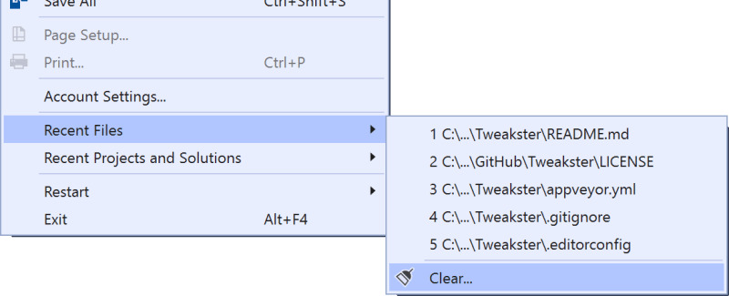

### IDE

<h4 id="restart">Restart Visual Studio command</h4>

Inspired by the suggestion [Add a Restart Visual Studio option to 'File' menu](https://developercommunity.visualstudio.com/idea/537213/add-a-restart-visual-studio-option-to-file-menu.html).

Make it easy to restart Visual Studio. If it's running elevated, it will restart back into elevated mode. The shortcut key is **Shift+Alt+F4**.

You can also restart specifically into Admin or Safe modes.

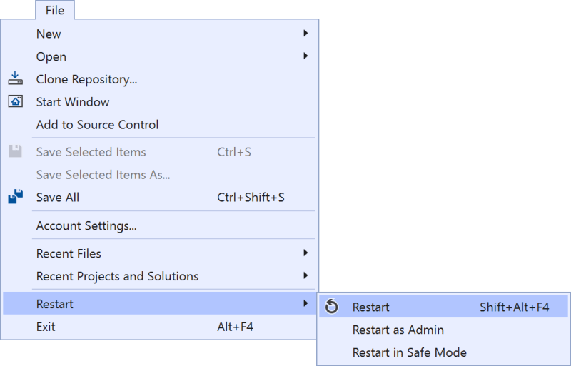

<h4 id="safemode">Open in <i>/SafeMode</i> from Jump List</h4>

Inspired by the suggestion [Add a Restart Visual Studio option to 'File' menu](https://developercommunity.visualstudio.com/idea/537213/add-a-restart-visual-studio-option-to-file-menu.html).

Adds a task to the Windows Jump List making it easy to open  Visual studio with the `/SafeMode` command line argument.

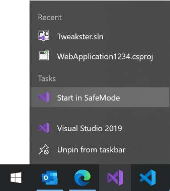

<h4 id="demomode">Presentation Mode</h4>

Inspired by the suggestion [Visual Studio Presentation Mode](https://developercommunity.visualstudio.com/idea/842920/visual-studio-presentation-mode.html).

Adds a presentation mode that starts up an instance of Visual Studio with its own settings, window layout, extensions, etc. Customize it to your presentation style without it changes anything in the regular instance of Visual Studio.

For more information and how to get the most out of Presentaion Mode, see [5-minute video](https://youtu.be/7wMJIYz9lvU).

It starts Visual Studio with the `/RootSuffix Demo` command line argument.

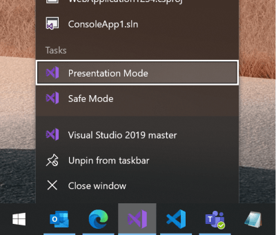

<h4 id="browsesuggestions">Browse existing feature suggestions</h4>

Inspired by the suggestion [Make it easy to discover existing suggestions to vote/comment on
](https://developercommunity.visualstudio.com/content/idea/774869/developercommunityvisualstudiocom-plese-permit-us.html).

A command under **Help -> Send Feedback** that opens your browser to the [feature suggestion page](https://aka.ms/browsesuggestions) on the Developer Community.

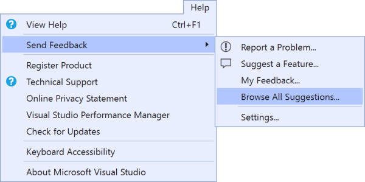

### Build

<h4 id="outputverbosity">Set verbosity level in Output Window</h4>

Inspired by the suggestion [Add a checkbox to the Output Window's context menu to toggle verbose trace messages ON or OFF](https://developercommunity.visualstudio.com/content/idea/525023/add-a-checkbox-to-the-output-windows-checkboxes-to.html).

You can now change the logging verbosity level directly from the *Output Window* instead of having to go to **Tools -> Options** every time.

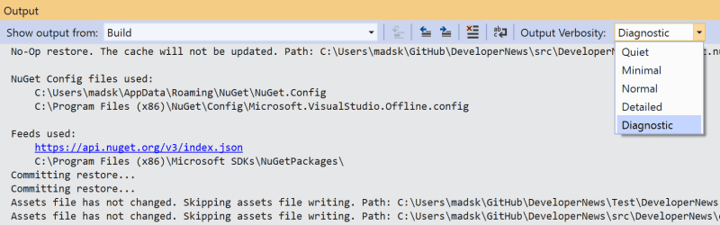

<h4 id="savesolutiononbuild">Save solution on build</h4>

Inspired by the suggestion [Save Solution on Build](https://developercommunity.visualstudio.com/idea/672715/save-solution-on-build.html).

When executing a build, the solution, project and all unsaved files that are part of the solution will be saved. This ensures that the .suo file is kept current in case of any crash caused by the running app. 

<h4 id="deleteoutputartifacts">Delete obj and bin folders on <i>Clean</i></h4>

Inspired by the suggestion [Aggresive Clean Output Option](https://developercommunity.visualstudio.com/idea/698053/aggresive-clean-output-option.html).

Both *bin* and *obj* are now fully deleted when the *Clean* command is executed. It does so right before the regular *Clean* command runs. The *Clean* command will add the *bin* and *obj* folders back, so be aware of that when testing this feature.

<h4 id="buildstats">Show build time statistics</h4>

Inspired by the suggestion [Build Statistics](https://developercommunity.visualstudio.com/idea/526989/build-statistics.html).

After any *Build*, *Rebuild*, *Clean*, or *Deploy* is executed, the time statistics are written to the output window.

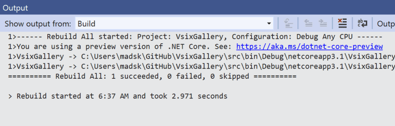

### Debugger

<h4 id="justmycode">Toggle <i>Just My Code</i> from the <i>Debug</i> toolbar</h4>

Inspired by the suggestion [Expose "Enable Just My Code" option directly in the "Exception Settings" tool Window](https://developercommunity.visualstudio.com/idea/1117639/expose-enable-just-my-code-option-directly-in-the.html).

There is now a toggle button on the *Debug* toolbar, so you no longer have to go through **Tools -> Options -> Debugging** to set it.

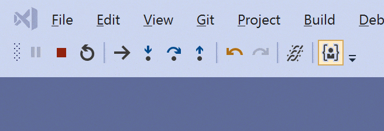

<h4 id="nodebugonf10">Don't start debug on F10/F11</h4>

Inspired by the suggestion [Please provide a way to disable F10/F11 until debug mode is entered](https://developercommunity.visualstudio.com/idea/960671/please-provide-a-way-to-disable-f10f11-until-debug.html).

**F10** (*Step Over*) and **F11** (*Step Into*) are two commands people often hit by accident. That starts a new debugging session and that can be annoying if you didn't mean for that to happen. They should only take effect during a debug session. 

### Editor

<h4 id="codecleanup">Run Code Cleanup on format (C# only)</h4>

Inspired by the suggestion [Cleanup code during formatting](https://developercommunity.visualstudio.com/idea/420291/cleanup-code-during-formatting.html).

Instead of running the *Code Cleanup* command manually, it now runs automatically when *Format Document* or **Ctrl+K,Ctrl+D** is invoked. 

<h4 id="dontcopyemptylines">Don't copy empty lines</h4>

Inspired by the suggestion [Please stop clearing the clipboard when you hit ctrl+c and nothing is selected](https://developercommunity.visualstudio.com/idea/693790/please-stop-clearing-the-clipboard-when-you-hit-ct.html).

When the cursor is in an empty line and you hit **Ctrl+C** to *copy*, then the empty lines is added to the clipboard. That is a wrong default behavior that this extension fixes.

<h4 id="dontcopyemptyselection">Don't copy when there's no selection</h4>

Inspired by the suggestion [Please stop clearing the clipboard when you hit ctrl+c and nothing is selected](https://developercommunity.visualstudio.com/idea/693790/please-stop-clearing-the-clipboard-when-you-hit-ct.html).

When you make no selection and hit *Copy* or **Ctrl+C** then nothing is copied to the clipboard like it normally would.

<h4 id="copywithoutindentation">Copy without indentation</h4>

Inspired by the suggestion [Easy copy code without indentation](https://developercommunity.visualstudio.com/idea/1156022/easy-copy-code-without-indentation.html).

Removes indentation from subsequent lines when the selection starts after leading indentation.

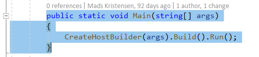

<h4 id="formatonlinemove">Format on moving line up/down</h4>

Inspired by the suggestion [Move lines up/down command should correct indentation](https://developercommunity.visualstudio.com/idea/1068219/move-lines-updown-command-should-correct-indentati.html).

When using **Alt+Up/Down** arrow keys to move lines up and down in the editor, those lines will now indent correctly as they move. This is supported for C#, Visual Basic, and HTML.

<h4 id="disablezoom">Disable editor zoom on mouse wheel</h4>

Inspired by the suggestion [fix zoom feature](https://developercommunity.visualstudio.com/idea/474557/fix-zoom-feature.html).

People often zoom in the editor accidently by hitting **Ctrl+MouseWheel**. Zooming is now disabled by this mechanism, but can be re-enabled in the settings.

You can still zoom in using **Ctrl+Shift+.** and zoom out using **Ctrl+Shift+,**

<h4 id="resetzoom">Reset zoom</h4>

Inspired by the suggestion [fix zoom feature](https://developercommunity.visualstudio.com/idea/474557/fix-zoom-feature.html).

The ability to reset the editor zoom level using the shortcuts **Ctrl+0**. In the settings, you can chose what the default zoom level should be. The default value is *100*.

<h4 id="selectfile">Select current file in Solution Explorer</h4>

Inspired by the suggestion [Add entry for "Sync with Active Document" in the right-click context menu for a document tab](https://developercommunity.visualstudio.com/idea/702650/new-menu-entry-select-in-solution-explorer.html).

Adds a command to the document tab context menu that will select the file in Solution Explorer.

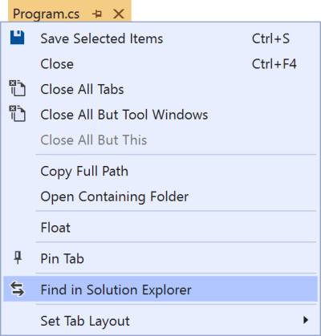

<h4 id="duplicatewindow">Duplicate code window</h4>

Inspired by the suggestion [add "New Window"-command to tab context-menu](https://developercommunity.visualstudio.com/idea/1128818/add-new-window-command-to-tab-context-menu.html).

Easily duplicate (or clone) a code window directly from the context menu on the document tabs. This is the same command as **Window -> New Window**, but in a more convenient location and with a more descriptive name. 

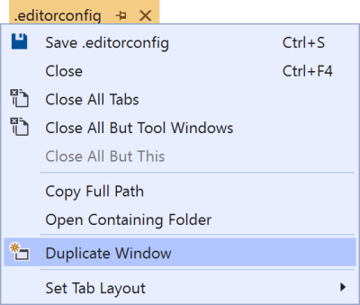

<h4 id="languagesettings">Open language settings from context menu</h4>

Inspired by the suggestion [Add language settings command to editor context menu](https://developercommunity.visualstudio.com/idea/1124164/add-language-settings-command-to-editor-context-me.html).

Some language such as HTML and CSS expose commands to open **Tools -> Options** directly to their settings. But most other languages does not. So now a Settings... command is added to C/C++, C#, JavaScript, TypeScript, Visual Basic, and XML.

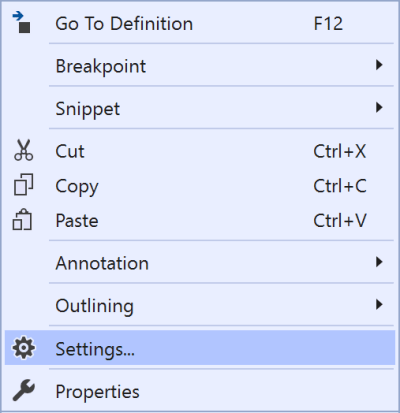

<h4 id="pastespecial">Added <i>Paste Special</i> to editor context menu</h4>

Inspired by the suggestion [Please add "Paste Special" to the Context Menu](https://developercommunity.visualstudio.com/idea/851239/please-add-paste-special-to-the-context-menu.html).

The *Paste Special* fly-out menu has been located under the *Edit* top level menu for many years, but never in the editor context menu next to the *Paste* command. Until now.

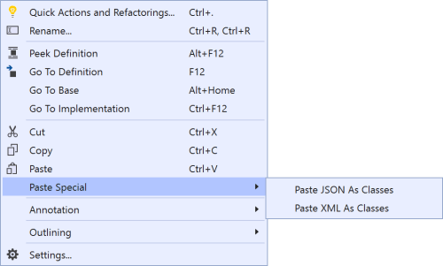

<h4 id="collapseattributes">Collapse to hide C# attributes</h4>

Inspired by the suggestion [Show/Hide member attributes](https://developercommunity.visualstudio.com/idea/1125506/showhide-member-attributes.html).

You can now collapse member- and class attributes in C# to reduce visual noise.

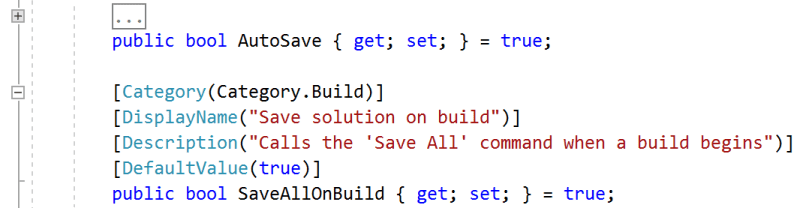

<h4 id="selectwholeline">Select Whole Line</h4>

To select the whole line, hit **Shift+Alt+E** or go to *Edit -> Advanced -> Select Whole Line*.

<h4 id="warnonpaste">Warn on paste huge text</h4>

When pasting huge amounts of text into the editor, Visual Studio will ask you to confirm. This is to avoid accidental inserts that may cause Visual Studio to freeze.

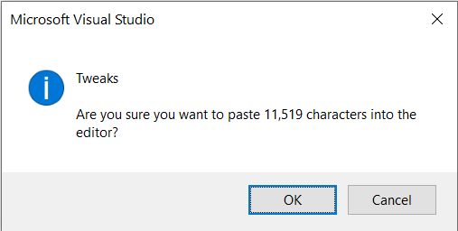

<h4 id="settings">Settings</h4>

You can enable or disable the various tweaks to your liking.

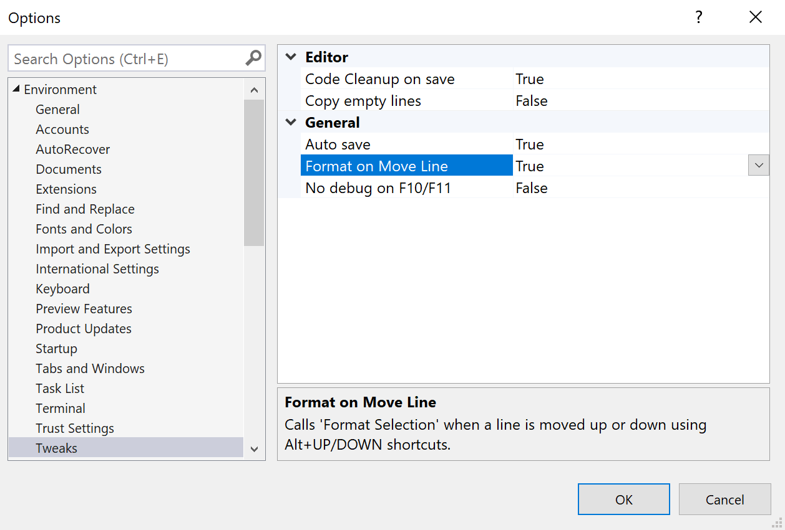

## License
[Apache 2.0](LICENSE)