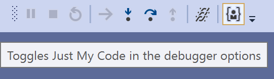

# Tweaks for Visual Studio

A collection of minor fixes and tweaks for Visual Studio to reduce the paper cuts and make you a happier developer

<!--Download this extension from the [Marketplace](https://marketplace.visualstudio.com/items?itemName=MadsKristensen.KnownMonikersExplorer)
or get the [CI build](https://www.vsixgallery.com/extension/0c8bd9fa-77d5-4563-ab57-9e01608c3d04/).-->

----------------------------------------------

## Features
The list of features are coming from the [Visual Studio Developer Community](https://developercommunity.visualstudio.com/topics/extension+candidate.html?page=1&pageSize=15&sort=votes&openOnly=false&closedOnly=false&topics=extension%20candidate) where users are posting feature suggestions and problem report tickets. 
It's from those tickets inspiration for this extension came.

* [Run *Code Cleanup* on format](#codecleanup)
* [Set verbosity level in Output Window](#outputverbosity)
<!--* [Toggle *Just My Code* from the *Debug* toolbar](#justmycode)-->
* [Re-open closed file](#reopen)
* [Auto save](#autosave)
* [Save solution on build](#savesolutiononbuild)
* [Don't copy empty lines](#dontcopyemptylines)
* [Don't start debug on F10/F11](#nodebugonf10)
* [Restart command](#restart)
* [Delete obj and bin folders on *Clean*](#deleteoutputartifacts)
* [Format on moving line up/down](#formatonlinemove)
* [Disable editor zoom on mouse wheel](#disablezoom)
* [Reset zoom](#resetzoom)
* [Settings](#settings)

If you know of any suggestion tickets that would be well suited for this extension to implement, please [open an issue](https://github.com/madskristensen/Tweakster/issues) on it. Find inspiration by [browsing the Developer Community](https://developercommunity.visualstudio.com/spaces/8/visual-studio-ide.html?sort=votes&type=idea&openOnly=true) for more suggestions.

<h3 id="codecleanup">Run Code Cleanup on format (C# only)</h3>

Inspired by the suggestion [Cleanup code during formatting](https://developercommunity.visualstudio.com/idea/420291/cleanup-code-during-formatting.html).

Instead of running the *Code Cleanup* command manually, it now runs automatically when *Format Document* or **Ctrl+K,Ctrl+D** is invoked. 

<h3 id="outputverbosity">Set verbosity level in Output Window</h3>

Inspired by the suggestion [Add a checkbox to the Output Window's context menu to toggle verbose trace messages ON or OFF](https://developercommunity.visualstudio.com/content/idea/525023/add-a-checkbox-to-the-output-windows-checkboxes-to.html).

You can now change the logging verbosity level directly from the *Output Window* instead of having to go to **Tools -> Options** every time.

<!--
<h3 id="justmycode">Toggle <i>Just My Code</i> from the <i>Debug</i> toolbar</h3>

Inspired by the suggestion [Expose "Enable Just My Code" option directly in the "Exception Settings" tool Window](https://developercommunity.visualstudio.com/idea/1117639/expose-enable-just-my-code-option-directly-in-the.html).

There is now a toggle button on the *Debug* toolbar, so you no longer have to go through **Tools -> Options -> Debugging** to set it.

-->
<h3 id="reopen">Re-open closed file</h3>

Inspired by the suggestion [Reopen closed tab](https://developercommunity.visualstudio.com/content/idea/402931/reopen-closed-tab.html).

When you close a file by accident, you can now easily open it back up again. Go to **File -> Re-Open [file name]**

<h3 id="autosave">Auto save</h3>

Inspired by the suggestion [Option to Auto Save the editor pages](https://developercommunity.visualstudio.com/idea/371187/option-to-auto-save-the-editor-pages.html).

Automatic saving of documents happen when the document loses focus. That could happen when you open a different document or click around in another tool window such as Solution Explorer. It will also save any changes to its containing project.

Projects are also automatically saved when files are added, removed or renamed. 

<h3 id="savesolutiononbuild">Save solution on build</h3>

Inspired by the suggestion [Save Solution on Build](https://developercommunity.visualstudio.com/idea/672715/save-solution-on-build.html).

When executing a build, the solution, project and all unsaved files that are part of the solution will be saved. This ensures that the .suo file is kept current in case of any crash caused by the running app. 

<h3 id="dontcopyemptylines">Don't copy empty lines</h3>

Inspired by the suggestion [Please stop clearing the clipboard when you hit ctrl+c and nothing is selected](https://developercommunity.visualstudio.com/idea/693790/please-stop-clearing-the-clipboard-when-you-hit-ct.html).

When the caret is placed on an empty line and you hit *Copy* or **Ctrl+C** then the empty lines isn't copied to the clipboard like it normally would.

<h3 id="nodebugonf10">Don't start debug on F10/F11</h3>

Inspired by the suggestion [Please provide a way to disable F10/F11 until debug mode is entered](https://developercommunity.visualstudio.com/idea/960671/please-provide-a-way-to-disable-f10f11-until-debug.html).

**F10** (*Step Over*) and **F11** (*Step Into*) are two commands people often hit by accident. That starts a new debugging session and that can be annoying if you didn't mean for that to happen. They should only take effect during a debug session. 

<h3 id="restart">Restart command</h3>

Inspired by the suggestion [Add a Restart Visual Studio option to 'File' menu](https://developercommunity.visualstudio.com/idea/537213/add-a-restart-visual-studio-option-to-file-menu.html).

Make it easy to restart Visual Studio. If it's running elevated, it will restart back into elevated mode. The shortcut key is **Shift+Alt+F4**.

<h3 id="deleteoutputartifacts">Delete obj and bin folders on <i>Clean</i></h3>

Inspired by the suggestion [Aggresive Clean Output Option](https://developercommunity.visualstudio.com/idea/698053/aggresive-clean-output-option.html).

Both *bin* and *obj* are now fully deleted when the *Clean* command is executed. It does so right before the regular *Clean* command runs. The *Clean* command will add the *bin* and *obj* folders back, so be aware of that when testing this feature.

<h3 id="formatonlinemove">Format on moving line up/down</h3>

Inspired by the suggestion [Move lines up/down command should correct indentation](https://developercommunity.visualstudio.com/idea/1068219/move-lines-updown-command-should-correct-indentati.html).

When using **Alt+Up/Down** arrow keys to move lines up and down in the editor, those lines will now indent correctly as they move. This is supported for C#, Visual Basic, and HTML.

<h3 id="disablezoom">Disable editor zoom on mouse wheel</h3>

Inspired by the suggestion [fix zoom feature](https://developercommunity.visualstudio.com/idea/474557/fix-zoom-feature.html).

People often zoom in the editor accidently by hitting **Ctrl+MouseWheel**. Zooming is now disabled by this mechanism, but can be re-enabled in the settings.

You can still zoom in using **Ctrl+Shift+.** and zoom out using **Ctrl+Shift+,**

<h3 id="disablezoom">Reset zoom</h3>

Inspired by the suggestion [fix zoom feature](https://developercommunity.visualstudio.com/idea/474557/fix-zoom-feature.html).

The ability to reset the editor zoom level using the shortcuts **Ctrl+0**. In the settings, you can chose what the default zoom level should be. The default value is *100*.

<h3 id="settings">Settings</h3>

You can enable or disable the various tweaks to your liking.

## License
[Apache 2.0](LICENSE)